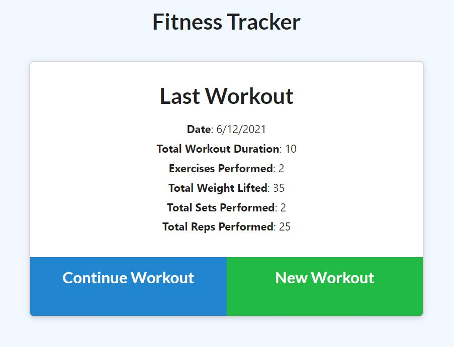
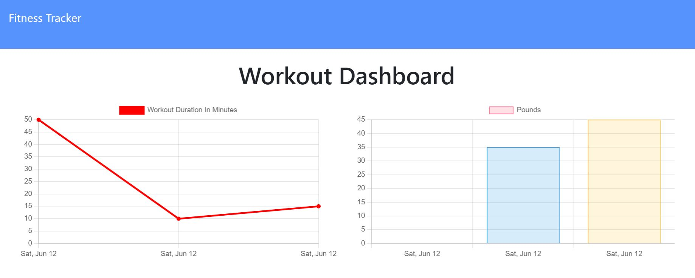

# Fitness-Tracker
Allows you to track both cardio and resistence workouts, mileage, duration, weight, sets and reps.

# Description
A fitness tracking app utilizing Node.js, MongoDB, Express.js, Heroku and Mongoose.  This app saves your data to a mongoDB database.

# Deployed App:
https://dustins-fitness-tracker.herokuapp.com/

# Github Repository:
https://github.com/DustinGottlieb/dustins-fitness-tracker

# Screenshots:

